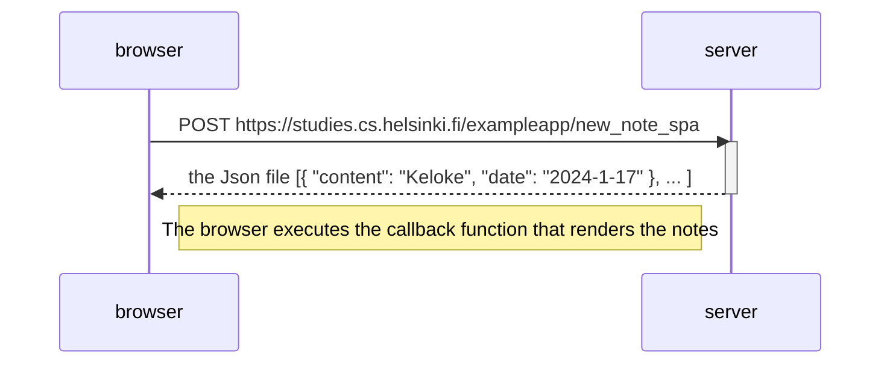

EXERCISE 0.6

```mermaid
    
    sequenceDiagram
        participant browser
        participant server
    
        browser->>server: POST https://studies.cs.helsinki.fi/exampleapp/new_note_spa
        activate server
        server-->>browser: the Json file [{ "content": "Keloke", "date": "2024-1-17" }, ... ]
        deactivate server
    
        Note right of browser: The browser executes the callback function that renders the notes
```
    
